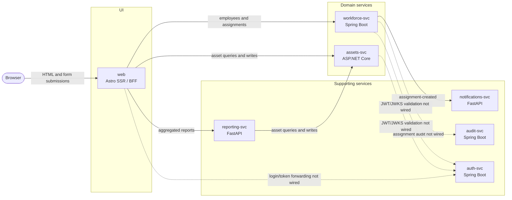

# AssetTrack Architecture

AssetTrack is an intentionally vulnerable, polyglot teaching application. It
combines seven independently runnable services with a second subsystem that
generates cumulative learner branches for the Advanced Copilot CLI course.

This document describes the implementation on `main`, including boundaries that
are planned or configured but not yet enforced.

## System context

`web` is the browser-facing boundary and composes backend responses on the
server. The backend services communicate primarily through HTTP and JSON.
`reporting-svc` accepts multipart CSV uploads in addition to JSON APIs.

There is no gateway, message broker, service mesh, shared transaction, or shared
database. Service URLs are configured through environment variables.

## Services

### `web`

**Purpose:** Server-rendered UI and backend composition.

**Stack:** Astro SSR, the Astro Node adapter, TypeScript, and Bootstrap 5. React
and the Astro React integration are installed, but no React islands are
currently used.

**Entry points and modules:**

- `astro.config.mjs` configures standalone Node SSR.
- `src/pages/**/*.astro` defines filesystem routes.
- `src/layouts/Layout.astro` provides the shared page shell and navigation.
- `src/components/StatusBadge.astro` renders asset states.
- `src/lib/api/client.ts` centralizes backend URLs and HTTP error handling.
- `src/lib/api/assets.ts`, `workforce.ts`, and `reporting.ts` are typed backend
  clients.

The dashboard and detail pages make multiple server-side calls and compose the
result into HTML. There is no browser-side state layer or frontend database.

### `assets-svc`

**Purpose:** Asset CRUD, search, tag lookup, and status statistics.

**Stack:** .NET 10, ASP.NET Core minimal APIs, Dapper, and SQLite.

**Entry points and modules:**

- `Program.cs` configures services, CORS, Swagger, database initialization, and
  routes.
- `Endpoints/AssetEndpoints.cs` contains the minimal API handlers.
- `Models/Asset.cs` defines response and create/update shapes.
- `Data/AssetsDb.cs` creates the schema and opens connections.
- `Data/SeedData.cs` populates an empty database.

The service owns the `assets` table. Dates and statuses are stored as text.
Schema creation happens at startup rather than through versioned migrations.

### `workforce-svc`

**Purpose:** Employee records and asset assignments.

**Stack:** Java 21, Spring Boot 3.5, Spring Data JPA, Hibernate's community
SQLite dialect, and SQLite.

**Entry points and modules:**

- `WorkforceApplication.java` starts Spring Boot.
- `employee/` contains the employee entity, repository, and controller.
- `assignment/` contains the assignment entity, repository, controller, and
  service.
- `HttpClientsConfig.java` defines notification and audit `RestClient` beans.
- `src/main/resources/data.sql` contains generated seed data.

Hibernate updates the schema at startup and Spring loads `data.sql`. Assignments
store scalar `assetId` and `employeeId` values rather than ORM relationships or
cross-service foreign keys.

The service enforces one active assignment per asset. Other business rules are
currently left unenforced.

### `reporting-svc`

**Purpose:** Warranty and utilization reports plus CSV import.

**Stack:** Python 3.12, FastAPI, HTTPX, and Pydantic.

**Entry points and modules:**

- `app/main.py` constructs the FastAPI application.
- `app/routers/reports.py` queries `assets-svc` and computes live reports.
- `app/routers/imports_.py` parses CSV uploads and creates assets over HTTP.
- `app/legacy/format_helpers.py` contains deliberately dated helper code.

The service has no primary database. The `reporting_data` Docker Compose volume
is currently unused. `WORKFORCE_SVC_URL` is configured but no current report
uses workforce data.

CSV import is sequential and non-transactional. If a later row fails, assets
created from earlier rows remain committed.

### `notifications-svc`

**Purpose:** Receive assignment webhooks and stand in for email and Slack
delivery.

**Stack:** Python 3.12, FastAPI, and the standard-library SQLite driver.

`app/main.py` contains application startup, schema creation, endpoint handlers,
and persistence. Received payloads are written to a local `events` table and
logged as email/Slack stubs.

There is no queue, retry, dead-letter path, or independent delivery worker.
Workforce makes a synchronous HTTP request and catches any resulting exception.

### `audit-svc`

**Purpose:** Store and search audit events.

**Stack:** Java 21, Spring Boot 4.1, Spring JDBC, and SQLite.

- `AuditController.java` exposes event creation and lookup.
- `AuditRepository.java` performs JDBC operations.
- `DataInit.java` creates and seeds the table at startup.

The service is operational, but workforce does not currently send assignment
events to it. The search implementation deliberately concatenates user input
into SQL as a course security exercise.

### `auth-svc`

**Purpose:** User lookup, credential checking, RS256 JWT issuance, and JWKS
publication.

**Stack:** Java 21, Spring Boot 4.1, Spring JDBC, JJWT with Gson serialization,
and SQLite.

- `TokenController.java` exposes token, JWKS, health, and user endpoints.
- `UserRepository.java` performs user lookup.
- `JwtIssuer.java` generates the signing key and issues tokens.
- `DataInit.java` creates and seeds users.

The service seeds plaintext passwords and generates a new RSA key pair at every
startup. Restarting it invalidates previously issued tokens. Username lookup
also contains deliberate SQL injection.

No consuming service currently validates these JWTs. `AUTH_JWKS_URL` and
`DEV_TOKEN_MODE` are configuration placeholders rather than active controls.

## Data ownership

| Store | Owner | Initialization |
|---|---|---|
| `assets.db` | `assets-svc` | Dapper startup DDL and generated C# seed data |
| `workforce.db` | `workforce-svc` | Hibernate schema update and `data.sql` |
| `notifications.db` | `notifications-svc` | Python import-time SQLite DDL |
| `audit.db` | `audit-svc` | Spring `CommandLineRunner` DDL and seed inserts |
| `auth.db` | `auth-svc` | Spring `CommandLineRunner` DDL and seed inserts |

`web` and `reporting-svc` do not own databases.

The databases are independent. For example, an assignment's `assetId` is not a
foreign key to `assets-svc`, so workforce cannot rely on the database to prove
that an asset exists or is assignable.

`tools/seedgen.py` deterministically generates asset, employee, assignment, and
CSV seed data. It intentionally preserves some inconsistent states for course
exercises, including inactive employees with assignments and lost or retired
assets that remain assigned.

## Primary request flows

### Render the dashboard

1. The browser requests `/` from `web`.
2. Astro calls `assets-svc` for status counts.
3. Astro calls `workforce-svc` for employees.
4. Astro calls `reporting-svc` for utilization.
5. Astro composes the responses into server-rendered HTML.

Backend failures are shown as warnings, allowing the page to render partial
data.

### Create an asset

1. The browser submits the Astro form at `/assets/new`.
2. Astro converts form values into JSON without validation.
3. `assets-svc` inserts the values into SQLite.
4. Astro redirects to the new asset detail page.

Invalid nullable fields, duplicate tags, and database constraints are not
translated into stable validation responses.

### Create an assignment

1. A client posts an assignment to `workforce-svc`.
2. Workforce checks only whether the asset already has an active assignment.
3. JPA saves the assignment.
4. Workforce synchronously posts an assignment-created webhook to
   `notifications-svc`.
5. Notification failures are discarded.
6. No audit event is sent.

Workforce does not consult `assets-svc`, so it does not prove that the asset
exists or reject lost or retired assets. It also does not reject inactive or
nonexistent employees at the service layer.

### Import assets from CSV

1. A client uploads a multipart CSV file to `reporting-svc`.
2. Reporting checks that required column headers exist.
3. It posts each row individually to `assets-svc`.
4. The first parsing or HTTP error aborts the request.

There is no transaction spanning the imported rows, so the operation can leave
a partially imported file.

## Runtime and deployment

The root `package.json` uses `concurrently` to run all seven services as local
processes on ports 4321 and 5001-5006. Docker Compose builds one container per
service and uses port 8080 inside each backend container.

The devcontainer provides Node 22, .NET 10, Python 3.12, Java 21, and Maven.
The web Dockerfile currently uses Node 20, which differs from the documented
local development version.

SQLite files live under local service `data/` directories during `npm run dev`
and named Docker volumes under Compose.

## Course branch subsystem

`course-build/` is independent course infrastructure rather than an application
runtime service.

- `manifest.json` records the base commit, ordered module deltas, provenance,
  expected assets, and expected tree hashes.
- `scripts/build-branches.mjs` constructs cumulative learner branches.
- `scripts/detect-affected-modules.mjs` maps upstream course changes to modules.
- `scripts/rederive-asset-module.mjs` recreates deterministic asset-backed
  deltas.
- `scripts/validate-branch.sh` builds a learner state and runs every suite
  present in that state.
- GitHub Actions regenerate, validate, secret-scan, and promote generated refs.

These workflows provide strong validation for generated learner states, but the
current repository does not have equivalent general CI for every ordinary
application pull request.

## Intentionally unenforced rules

The following are known teaching gaps rather than guarantees:

| Area | Unenforced rule or missing control |
|---|---|
| Authentication | Backend requests should carry and validate JWTs |
| Assets | Required fields, allowed statuses, sensible dates, and duplicate tags should produce validation errors |
| Assignments | Employees and assets should exist before assignment |
| Assignments | Inactive employees should not receive assets |
| Assignments | Lost or retired assets should not be assigned |
| Assignments | Return dates should not precede assignment dates |
| Auditing | Assignment creation and return should create audit events |
| Notifications | Delivery should have observable retries or durable failure handling |
| Imports | Bad CSV rows should be skipped and summarized without corrupting the overall result |
| Security | SQL input should be parameterized and passwords should be hashed |
| Quality | Service tests, linting, type checks, and normal pull-request CI should be enforced |

See [`exercises.md`](exercises.md) before correcting an apparent defect: many
gaps are deliberately preserved as exercise targets.
