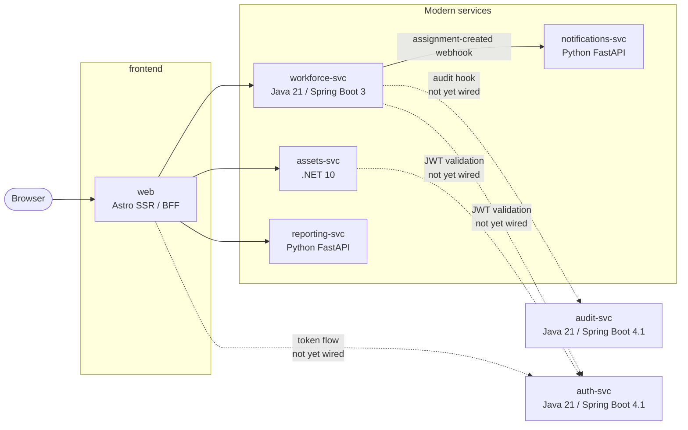

# AssetTrack (Contoso Industries)

> [!IMPORTANT]
> **Security Warning**
>
> This repository contains intentionally insecure code and an intentionally vulnerable application for educational and security-testing purposes only. Do not deploy it to production, expose it to the public internet, or run it on systems containing sensitive data. Use it only in an isolated, authorized environment, such as a sandbox or disposable virtual machine. You are responsible for preventing unauthorized access, misuse, or unintended impact on your systems and networks.

AssetTrack is Contoso Industries' internal application for tracking hardware assets (laptops, monitors, phones, badges, docking stations) and the employees they're assigned to. It is intentionally built as a **polyglot microservices** application so that course learners can practice agentic, Copilot-driven development across a realistic multi-language stack.

## Architecture at a glance



The browser receives server-rendered HTML from `web`; backend integration is
primarily REST/JSON, with multipart upload for CSV imports. Services own their
data independently, but not every service has a database. Cross-service IDs are
application-level references and do not have database-enforced referential
integrity.

| Service              | Stack                                  | Port  | Responsibility / storage |
|----------------------|----------------------------------------|-------|--------------------------|
| `web`                | Astro SSR + Bootstrap 5; React integration installed but currently unused | 4321 | UI and server-side backend composition; no database |
| `assets-svc`         | .NET 10 (ASP.NET Core minimal APIs)    | 5001  | Asset CRUD/search; owns SQLite `assets` data |
| `workforce-svc`      | Java 21 / Spring Boot 3.5              | 5002  | Employees and assignments; owns SQLite workforce data |
| `reporting-svc`      | Python 3.12 / FastAPI                  | 5003  | Live reports and CSV import proxy; no primary database |
| `notifications-svc`  | Python 3.12 / FastAPI                  | 5004  | Assignment webhook receiver and delivery stubs; owns a SQLite event log |
| `audit-svc`          | Java 21 / Spring Boot 4.1              | 5005 | Audit event log in SQLite |
| `auth-svc`           | Java 21 / Spring Boot 4.1              | 5006 | User lookup, JWT issuance, and JWKS publication in SQLite |

See [`ARCHITECTURE.md`](ARCHITECTURE.md) for service boundaries, request flows,
data initialization, integration behavior, and currently unenforced rules.

## Quick start (Codespaces or local devcontainer)

1. Open the repository in GitHub Codespaces, or in VS Code with the Dev Containers extension.
2. Wait for the devcontainer to finish provisioning. It installs:
   - Node 22, .NET 10, Python 3.12, Maven, and **Java 21** (the JDK and bytecode target for all three JVM services).
   - `concurrently` and editable Python installs for the FastAPI services (via `postCreateCommand`).
3. From the workspace root:

   ```bash
   npm run dev
   ```

   This starts all seven services as plain processes (no Docker required). A startup banner prints the URL. Run `npm run dev:verbose` if you need full log output instead of WARN-only.

4. Open http://localhost:4321 — that's the UI. Backend services listen on 5001–5006 if you want to hit them directly with `curl`.

## Quick start (local without a devcontainer)

You need Node 22, .NET 10, Python 3.12, Maven, **and Java 21** on your machine. Then:

```bash
npm install
npm run install:all
npm run dev
```

## Running with Docker (optional)

A `docker-compose.yml` is still provided as an alternative to the dockerless workflow:

```bash
docker compose up --build
```

Open http://localhost:4321.

## Running a single service for development

Each service folder has its own `README.md` with native (non-Docker) run instructions and per-service scripts. See:

- [`services/web/README.md`](services/web/README.md)
- [`services/assets-svc/README.md`](services/assets-svc/README.md)
- [`services/workforce-svc/README.md`](services/workforce-svc/README.md)
- [`services/reporting-svc/README.md`](services/reporting-svc/README.md)
- [`services/notifications-svc/README.md`](services/notifications-svc/README.md)
- [`services/audit-svc/README.md`](services/audit-svc/README.md)
- [`services/auth-svc/README.md`](services/auth-svc/README.md)

## Auth

`auth-svc` issues RS256 JWTs from `POST /token` and publishes its public key at
`GET /.well-known/jwks`.

JWT validation and frontend token forwarding are **not currently implemented**.
`AUTH_JWKS_URL` and `DEV_TOKEN_MODE` are configured as placeholders for the auth
course exercise, but application code does not currently consume them. Setting
`DEV_TOKEN_MODE=false` does not enable an end-to-end login flow; all service
endpoints are presently unauthenticated.

## What's intentionally broken or missing

This is a teaching codebase. Several services have deliberate gaps that drive the course exercises (see [`exercises.md`](exercises.md)). For example:

- `auth-svc` and `audit-svc` contain SQL injection targets; auth also uses
  plaintext seeded passwords and a new in-memory signing key after each restart.
- JWTs are issued but not validated by other services.
- `reporting-svc` has old-style Python helpers and a non-transactional import
  endpoint that can partially import a CSV before a bad row aborts the request.
- `assets-svc` accepts unvalidated input on create and update.
- The dashboard renders some status badges with the wrong colors.
- `workforce-svc` does not reject inactive employees, nonexistent assets, or
  invalid return dates; it also does not POST assignment changes to `audit-svc`.
- Notification delivery has no queue or retry, and workforce silently discards
  notification failures.
- Test coverage and ordinary application CI are intentionally incomplete on
  `main`; most comprehensive validation belongs to generated course states.

See [`exercises.md`](exercises.md) for the full exercise list.

## Course exercises

See [`exercises.md`](exercises.md). Each exercise is **atomic** — completing one is not a prerequisite for another. Exercises cover all five stacks (Astro, .NET, modern Java, Python, legacy Java) so learners can pick what's most useful to them.

## Course branch infrastructure

The application source on `main` is also the base for generated
`start-of-module-*` learner branches. The deterministic branch generator,
ordered patch deltas, expected tree hashes, and promotion workflows live under
[`course-build/`](course-build/README.md).

Contributors should change `main`, not generated learner branches or generated
refs. The course workflows validate generated branch states; they are not a
substitute for general CI on every application pull request.

## License

This project is licensed under the terms of the MIT license. See [LICENSE](LICENSE) for the full text.

## Contributing

Contributions are welcome! Please read [CONTRIBUTING.md](CONTRIBUTING.md) for how to set up the polyglot devcontainer, run the tests, and open a pull request.

## Code of Conduct

This project has adopted a [Code of Conduct](CODE_OF_CONDUCT.md). By participating, you are expected to uphold it.

## Support

Looking for help? See [SUPPORT.md](SUPPORT.md) for how to file issues and get assistance.

## Security

To report a security vulnerability, please follow the process described in [SECURITY.md](SECURITY.md). Please do not report security issues through public GitHub issues.
